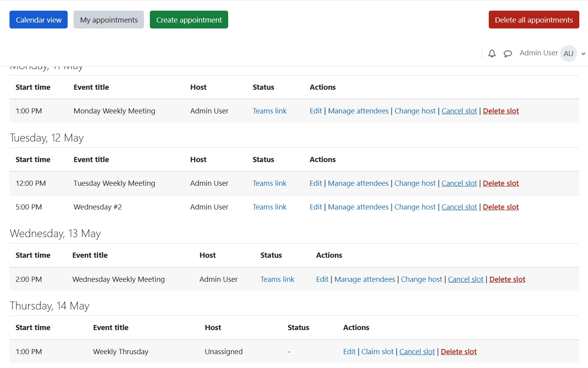
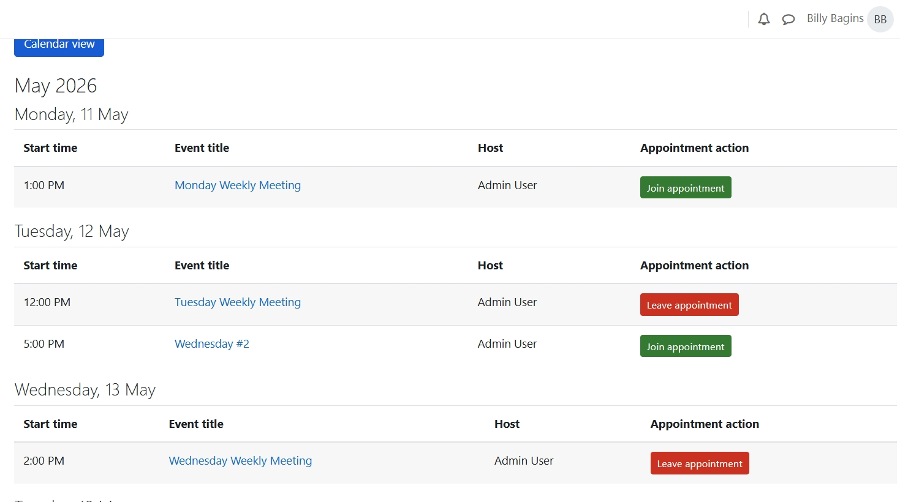
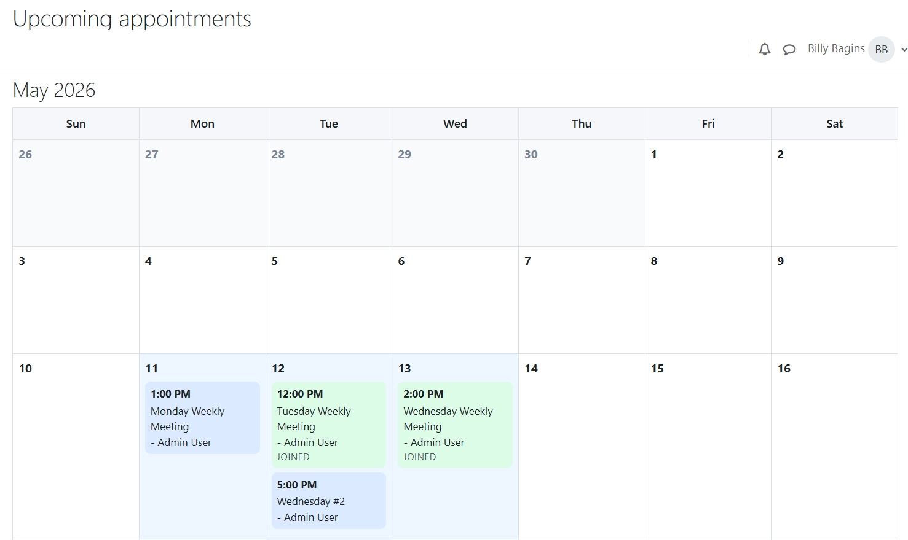

# MS Teams for Moodle

`local_msteams` is a local Moodle plugin that manages appointments backed by Moodle calendar events and can create Microsoft Teams meetings through Microsoft Graph.

## Features

- Create and manage appointment slots from Moodle
- Claim slots as a host
- Store slot metadata in dedicated plugin tables
- Create Teams-backed calendar events through Microsoft Graph
- Add attendee Moodle users to meetings
- Send reminder emails with a scheduled task
- View appointments in list and calendar layouts

## Screenshots

### Manage appointments

The scheduler management page for creating, updating, and administering appointments.

### Upcoming appointments

The public upcoming appointments list with join and leave actions for logged-in users.

### Upcoming calendar

The public calendar view for browsing available upcoming appointments.

## Requirements

- Moodle 4.1 or later
- Tested on Moodle 4.1.12
- A Microsoft 365 tenant with:
  - Exchange Online mailbox for the organizer account
  - Teams-enabled organizer account
  - Azure app registration with Microsoft Graph access

## Installation

1. Copy the plugin to:
   - `local/msteams`
2. Visit:
   - `Site administration -> Notifications`
3. Complete the Moodle upgrade

## Configuration

Go to:

- `Site administration -> Plugins -> Local plugins -> MS Teams`

Configure:

- Host role
- Reminder sender email
- Microsoft Graph tenant ID
- Microsoft Graph client ID
- Microsoft Graph client secret
- Organizer mailbox
- Graph timezone

## Notes

- This variant stores scheduler state in custom Moodle tables and only mirrors visible slot details into calendar events.
- Teams meeting creation depends on the organizer mailbox being fully provisioned for Teams and Exchange.

## Status

Current plugin metadata:

- Component: `local_msteams`
- Release: `0.3.0`
- Maturity: `MATURITY_BETA`

## Review Notes

- Reminder emails go to hosts and saved attendees.
